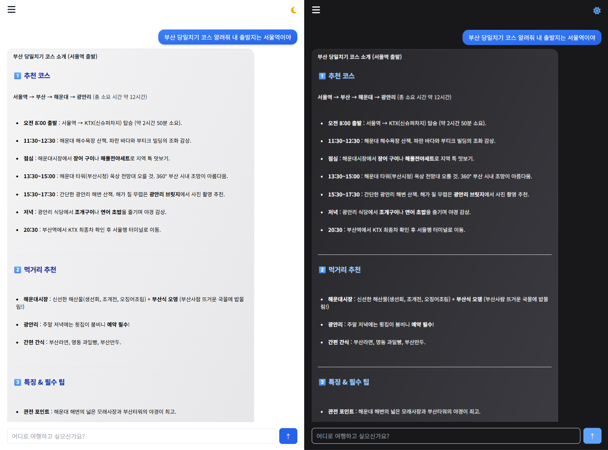

# [AI 여행 일정 생성기](https://tripgen-dev.vercel.app/)

사용자의 입력에 따라 맞춤형 여행 코스를 생성해주는 한국어 기반 AI 챗봇입니다.  
여행 기간, 비용 등을 입력하면 여행지 추천, 맛집, 팁까지 자동으로 구성된 일정을 제공합니다.

---

## 🚀 주요 기능

- **자유로운 한국어 입력/응답**
    - ex) "부산 당일치기 코스 알려줘", "5월 제주도 3박 4일 일정 추천해줘"
- **여행 정보 구조화 출력**
    - 추천 코스 / 먹거리 / 팁 항목으로 구성
  - **다크모드 및 라이트모드 UI 지원**
- **마크다운 기반 응답 렌더링**
- **채팅 기록 조회/생성/삭제 (DB 연동)**

---

## 🧩 변경 예정 사항

- 기존의 CSR 구조에서 SSR로 전환하여 초기 렌더링 속도 개선
- 초기 렌더링, 데이터 요청 시 로딩 처리(Spinner or typing typing animation)를 추가하여 UX 개선
- 응답 복사 버튼 기능을 추가 예정

---

## 🛠️ 기술 스택

| 영역        | 기술                           |
|-------------|------------------------------|
| Framework   | **React 19**, **Next.js 15** |
| Language    | **TypeScript**               |
| Styling     | **Tailwind CSS**             |
| API 통신    | **Groq API** (Qwen 모델) |
| Database    | **Prisma, Neon**             |
| Infra       | **Vercel**                   |
---

## ✏️ 화면 예시

